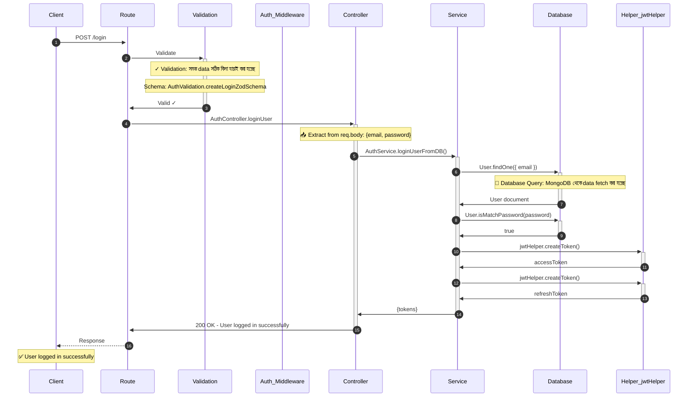
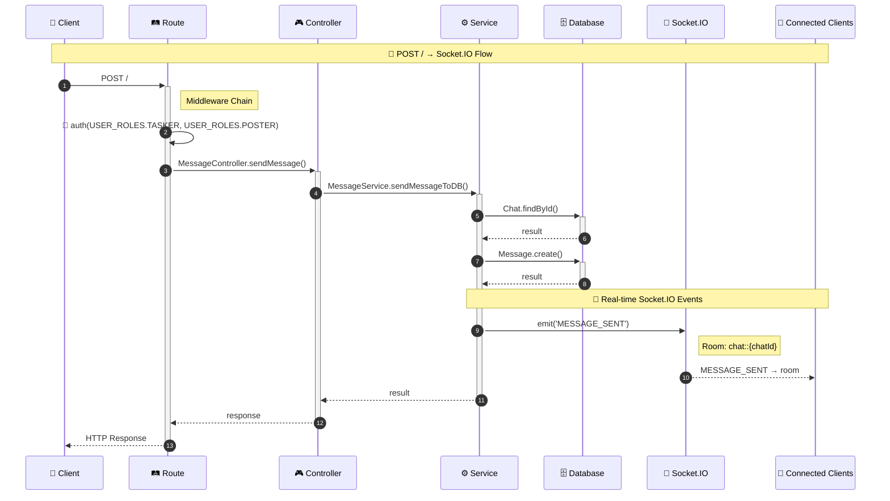

# 📊 Mermaid Sequence Diagram Generator

TypeScript/Express backend codebase থেকে **automatic Mermaid.js sequence diagrams** generate করার জন্য একটি powerful CLI tool।

## 🎯 উদ্দেশ্য

এই tool আপনার codebase analyze করে প্রতিটি API endpoint এর জন্য visual sequence diagram তৈরি করে, যা দেখে আপনি সহজেই বুঝতে পারবেন:

- 🔄 Request কীভাবে flow হয়
- 🛡️ কোন middleware গুলো execute হয়
- 🎮 Controller কোন service call করে
- 💾 Database-এ কোন operations হয়
- 📡 Real-time events (Socket.IO)
- 🌐 External API calls (Stripe, Firebase, etc.)

---

## ✨ বৈশিষ্ট্য

### ✅ Automatic Code Analysis
- Routes, controllers, services automatically detect করে
- Import statements follow করে dependencies খুঁজে বের করে
- AST-based parsing for accurate code analysis

### ✅ Rich Diagram Generation
- **3 Detail Levels**: Overview, Standard, Ultra-Detailed
- **Bangla Comments**: Important steps-এ Bangla explanation
- **Color-Coded**: Different flow types আলাদা color-এ
- **Interactive HTML**: Browser-এ diagram preview

### ✅ Comprehensive Coverage
- ✓ Middleware chain (auth, validation, file upload)
- ✓ Controller → Service flow
- ✓ Database queries (Mongoose operations)
- ✓ Helper function calls
- ✓ Socket.IO events
- ✓ External APIs (Stripe, Firebase, S3, Cloudinary)
- ✓ QueryBuilder/AggregationBuilder usage

### ✅ Combined REST + Socket.IO Flow (NEW! 🆕)
- ✓ **Auto-detection**: কোন REST endpoint কোন Socket.IO event emit করে তা automatically detect করে
- ✓ **Complete flow visualization**: REST call → Controller → Service → Socket.IO → Connected Clients
- ✓ **Room-based emit detection**: `io.to('room').emit()` pattern support
- ✓ **User-targeted emit detection**: `io.emit('event::userId')` pattern support
- ✓ **Template literal support**: Complex room expressions যেমন `` `chat::${chatId}` `` সঠিকভাবে parse করে

---

## 🚀 Installation

Dependencies already installed:

```json
{
  "@babel/parser": "^7.x",
  "@babel/traverse": "^7.x",
  "inquirer": "^8.x",
  "chalk": "^4.x"
}
```

No additional setup needed!

---

## 📖 Usage

### 1. Interactive Mode (Recommended)

```bash
node scripts/diagram-generator/sequence-diagram-generator.js
```

Interactive menu থেকে select করুন:
- 📍 Single Endpoint Diagram
- 📁 Full Module Diagram
- 🌐 All Modules Overview

### 2. Generate Specific Module

```bash
node scripts/diagram-generator/sequence-diagram-generator.js --module auth
```

Auth module এর সব endpoints এর জন্য diagrams তৈরি করবে।

### 3. Generate Specific Endpoint

```bash
node scripts/diagram-generator/sequence-diagram-generator.js --endpoint "POST /api/v1/auth/login"
```

শুধু login endpoint এর diagram generate করবে।

### 4. Generate All Modules

```bash
node scripts/diagram-generator/sequence-diagram-generator.js --all
```

সব modules এর সব endpoints এর জন্য diagrams তৈরি করবে।

### 5. Show Help

```bash
node scripts/diagram-generator/sequence-diagram-generator.js --help
```

### 6. Combined REST + Socket.IO Diagrams (NEW! 🆕)

**Unified CLI (Recommended):**
```bash
# Interactive mode - Option 6
node scripts/generate-diagrams.js

# Generate for specific module
node scripts/generate-diagrams.js --combined message

# Generate for all modules with Socket.IO
node scripts/generate-diagrams.js --combined

# View REST → Socket.IO mapping summary
node scripts/generate-diagrams.js --socket-map
```

**Output:**
```
📦 Module: message
   Endpoints with Socket: 2/3

   🌐 POST /
      → MessageController.sendMessage()
      → MessageService.sendMessageToDB()
      🔌 emit('MESSAGE_SENT') [room-emit] to room: chat::{chatId}

   🌐 POST /chat/:chatId/read
      → MessageController.markChatRead()
      → MessageService.markChatAsRead()
      🔌 emit('MESSAGE_READ') [room-emit] to room: chat::{chatId}
```

---

## 📂 Output Structure

Diagrams এই locations-এ save হয়:

```
scripts/diagram-generator/output/
├── diagrams/                              # Mermaid .mmd files
│   ├── auth-post-login-standard.mmd       # Standard sequence diagrams
│   ├── payment-post-escrow-standard.mmd
│   ├── message-post-send-standard.mmd
│   ├── message-post-combined.mmd          # 🆕 Combined REST+Socket diagrams
│   └── message-postchat-chatId-read-combined.mmd
├── html/                                  # Interactive HTML previews
│   ├── auth-post-login-standard.html
│   ├── payment-post-escrow-standard.html
│   ├── message-post-send-standard.html
│   ├── message-post-combined.html         # 🆕 Combined flow HTML
│   └── combined-index.html                # 🆕 Index page for all combined
└── images/                                # PNG exports (optional)
```

---

## 🎨 Detail Levels

### 1. 🎯 Overview (High-Level)
- Quick overview শুধু main flow
- Maximum 10 steps
- No payload/timing details

**Use case:** Rapid understanding, architecture reviews

### 2. 📊 Standard (Recommended) ⭐
- Balanced detail level
- Shows middleware, database queries, helpers
- Includes Bangla comments
- Maximum 30 steps

**Use case:** Development, documentation, onboarding

### 3. 🔬 Ultra-Detailed (Maximum)
- Complete information সব কিছু সহ
- Error scenarios included
- Performance timing (if available)
- Maximum 100 steps

**Use case:** Debugging, deep analysis, security review

---

## 📝 Example Diagrams

### Example 1: Auth Login Flow

**Command:**
```bash
node scripts/diagram-generator/sequence-diagram-generator.js --endpoint "POST /login"
```

**Generated Diagram:**



---

### Example 2: Payment Escrow Flow (Complex)

**Command:**
```bash
node scripts/diagram-generator/sequence-diagram-generator.js --endpoint "POST /api/v1/payments/escrow"
```

**Features Shown:**
- ✓ Auth middleware with role check
- ✓ Multiple service calls (PaymentService → StripeConnectService)
- ✓ External API (Stripe)
- ✓ Database operations
- ✓ Response with payment intent

---

### Example 3: Message Send (Real-time)

**Command:**
```bash
node scripts/diagram-generator/sequence-diagram-generator.js --module message
```

**Features Shown:**
- ✓ Socket.IO emit events
- ✓ Presence helper calls (isOnline)
- ✓ Unread count helpers
- ✓ Notification service integration
- ✓ Real-time client updates

---

### Example 4: Combined REST + Socket.IO Flow (NEW! 🆕)

**Command:**
```bash
node scripts/generate-diagrams.js --combined message
```

**Generated Diagram:**



**Features Shown:**
- ✓ Complete flow: REST → Controller → Service → Socket.IO → Clients
- ✓ Room-based Socket.IO emit (`io.to('chat::chatId').emit()`)
- ✓ Database operations before Socket emit
- ✓ Middleware chain visualization
- ✓ Auto-detected Socket.IO events from service code

**কীভাবে কাজ করে:**
1. Route analyzer routes থেকে controller method খুঁজে বের করে
2. Controller tracer service calls extract করে
3. Service tracer Socket.IO emit patterns detect করে
4. Room expression normalize করে (template literals সহ)
5. Complete flow diagram generate করে

---

## ⚙️ Configuration

Configure diagram generation in `scripts/diagram-generator/config.js`:

### Styling Options
```javascript
styling: {
  theme: 'default',        // 'default', 'dark', 'forest', 'neutral'
  fontSize: 14,
  noteBackground: '#fff3cd',
  errorColor: '#dc3545',
  successColor: '#28a745',
}
```

### Detail Settings
```javascript
detail: {
  showPayload: true,       // Show request/response data
  showValidation: true,    // Show validation rules
  showQueries: true,       // Show database queries
  showTiming: true,        // Show performance timing
  showErrors: true,        // Show error scenarios
  banglaComments: true,    // Add Bangla explanations
}
```

### Analysis Settings
```javascript
analysis: {
  maxDepth: 5,                   // Service call depth limit
  includeHelpers: true,          // Include helper calls
  includeMiddleware: true,       // Include middleware chain
  includeSocketIO: true,         // Include Socket.IO events
  includeExternalAPIs: true,     // Include Stripe/Firebase/etc
}
```

---

## 🔧 Advanced Usage

### Generate for Multiple Modules

```bash
for module in auth user payment message; do
  node scripts/diagram-generator/sequence-diagram-generator.js --module $module
done
```

### Generate with Custom Detail Level (Programmatic)

```javascript
const SequenceDiagramGenerator = require('./scripts/diagram-generator/sequence-diagram-generator');

const generator = new SequenceDiagramGenerator();
await generator.generateSingleDiagram('auth', route, 'detailed');
```

---

## 📊 Viewing Diagrams

### Method 1: Browser (Recommended)

Open HTML files:
```bash
start scripts/diagram-generator/output/html/auth-post-login-standard.html
```

### Method 2: VS Code Extension

Install **Markdown Preview Mermaid Support** extension:
1. Open `.mmd` file in VS Code
2. Right-click → "Open Preview"

### Method 3: Online Mermaid Editor

1. Copy `.mmd` file content
2. Paste in https://mermaid.live/
3. View/edit diagram

### Method 4: Export to PNG (Optional)

Install mermaid-cli:
```bash
npm install -g @mermaid-js/mermaid-cli
```

Export:
```bash
mmdc -i auth-post-login-standard.mmd -o auth-post-login.png
```

---

## 🛠️ Architecture

### Tool Components

```
scripts/
├── generate-diagrams.js           (🆕 Unified CLI - all diagram types)
├── diagram-generator/
│   ├── sequence-diagram-generator.js  (Original sequence diagram CLI)
│   ├── utils/
│   │   ├── codeParser.js           (AST parsing with @babel/parser)
│   │   ├── routeAnalyzer.js        (Route file analysis - enhanced)
│   │   ├── controllerTracer.js     (Controller method tracing - enhanced)
│   │   ├── serviceTracer.js        (Service method tracing - enhanced)
│   │   ├── mermaidGenerator.js     (Diagram code generation - enhanced)
│   │   └── restSocketMapper.js     (🆕 REST → Socket.IO mapping)
│   ├── config.js                   (Configuration)
│   └── output/                     (Generated diagrams)
```

### New Utility: RestSocketMapper (🆕)

`restSocketMapper.js` - REST API এবং Socket.IO events এর মধ্যে connection trace করে।

**Key Methods:**
```javascript
const mapper = new RestSocketMapper();

// Single module mapping
const moduleMap = mapper.buildModuleMapping('message');

// All modules mapping
const fullMap = mapper.buildFullMapping();

// Find endpoints by Socket event
const endpoints = mapper.findEndpointsByEvent('MESSAGE_SENT');

// Print CLI-friendly summary
mapper.printMappingSummary();
```

**Output Structure:**
```javascript
{
  moduleName: 'message',
  endpoints: [{
    method: 'POST',
    path: '/',
    controller: { name: 'MessageController', method: 'sendMessage' },
    service: { name: 'MessageService', method: 'sendMessageToDB' },
    socketEvents: [{
      type: 'room-emit',
      event: 'MESSAGE_SENT',
      room: 'chat::{chatId}'
    }],
    flow: [...]
  }]
}
```

### Analysis Flow

```
1. Route File Parse
   ↓
2. Extract Endpoints + Middleware
   ↓
3. Trace Controller Method
   ↓
4. Trace Service Calls
   ↓
5. Extract DB Operations, Helpers, Socket.IO
   ↓
6. Generate Mermaid Code
   ↓
7. Save .mmd + .html Files
```

---

## 💡 Tips & Best Practices

### ✅ DO

- ✅ Generate diagrams after major feature additions
- ✅ Use **Standard** detail level for documentation
- ✅ Review HTML previews in browser
- ✅ Keep diagrams in version control
- ✅ Update diagrams when flow changes

### ❌ DON'T

- ❌ Don't generate ultra-detailed for simple CRUD
- ❌ Don't edit generated `.mmd` files manually
- ❌ Don't commit `output/` directory to Git (add to .gitignore)

### 🎯 When to Use Each Level

| Detail Level | Use Case | Example |
|--------------|----------|---------|
| **Overview** | Quick understanding, presentations | Architecture review meetings |
| **Standard** | Documentation, onboarding | Developer handbook, README |
| **Detailed** | Debugging, security audit | Bug investigation, code review |

---

## 🐛 Troubleshooting

### Issue 1: "Controller file not found"

**Cause:** Module structure doesn't follow standard naming convention

**Solution:** Ensure files are named:
- `{module}.controller.ts`
- `{module}.service.ts`
- `{module}.route.ts`

---

### Issue 2: "No routes found"

**Cause:** Route file doesn't match expected patterns

**Solution:** Check route file uses:
```typescript
router.get('/path', ...)
router.post('/path', ...)
```

---

### Issue 3: Service calls not showing

**Cause:** Service not imported or called in controller

**Solution:** Verify controller has:
```typescript
import AuthService from './auth.service';
const result = await AuthService.loginUserFromDB(data);
```

---

### Issue 4: Diagram looks incomplete

**Cause:** Code patterns don't match analyzer expectations

**Solution:**
1. Check if controller wrapped with `catchAsync()`
2. Verify service uses standard Mongoose operations
3. Ensure naming conventions are followed

---

### Issue 5: Socket.IO events not detected (--socket-map shows 0)

**Cause:** Template literal বা complex expressions `io.to()` এর ভিতরে থাকলে পুরানো regex pattern match করতে পারত না।

**Example of problematic pattern:**
```typescript
// এই pattern আগে detect হতো না:
io.to(`chat::${String(payload?.chatId)}`).emit('MESSAGE_SENT', {...})
```

**Solution (Already Fixed):**

Bug fix করা হয়েছে `serviceTracer.js` এ। এখন নিম্নলিখিত patterns সব detect হয়:

| Pattern | Example | Status |
|---------|---------|--------|
| Simple string room | `io.to('room').emit('EVENT')` | ✅ Works |
| Template literal | `` io.to(`chat::${chatId}`).emit('EVENT') `` | ✅ Fixed |
| String with parentheses | `` io.to(`chat::${String(id)}`).emit('EVENT') `` | ✅ Fixed |
| Direct emit | `io.emit('EVENT')` | ✅ Works |
| User-targeted | `io.emit('event::userId')` | ✅ Works |

**Technical Fix Details:**
- **File:** `scripts/diagram-generator/utils/serviceTracer.js`
- **Method:** `extractSocketEvents()`
- **Change:** Regex pattern `[^)]+` → `([\s\S]*?)` (non-greedy any char)
- **Reason:** `[^)]` stopped at first `)` inside template literal expressions

---

### Issue 6: Controller method not found

**Cause:** TypeScript type annotations controller pattern এ match করত না।

**Example of problematic pattern:**
```typescript
// এই pattern আগে detect হতো না:
const sendMessage = catchAsync(async (req: Request, res: Response) => {
```

**Solution (Already Fixed):**

`controllerTracer.js` এ patterns update করা হয়েছে:

```javascript
// Now supports:
const method = catchAsync(async (req: Request, res: Response) => {...})
const method = async (req: Request, res: Response) => {...}
export const method = catchAsync(async (req: Request, res: Response) => {...})
```

---

### Issue 7: Multi-line routes not parsing correctly

**Cause:** Route definitions যা multiple lines এ span করত (inline middleware সহ) সঠিকভাবে parse হতো না।

**Solution (Already Fixed):**

`routeAnalyzer.js` এ `extractCompleteRouteDefinition()` method add করা হয়েছে যা:
- Parenthesis matching করে complete route definition extract করে
- Max 5000 chars পর্যন্ত support করে
- Complex inline middleware patterns handle করে

---

## 🚀 Future Enhancements

### Planned Features

- [ ] Error flow visualization (try-catch blocks)
- [ ] Performance timing annotations
- [ ] Database index usage highlighting
- [ ] API endpoint documentation generation
- [ ] PNG export built-in
- [ ] CI/CD integration script
- [ ] VS Code extension
- [ ] Diff view (compare diagram versions)

---

## 📚 Documentation

### Related Documentation

- [CLAUDE.md](../../CLAUDE.md) - Project overview and architecture
- [Logging System](../../doc/logging-tracing-system-deep-dive-bn.md) - OpenTelemetry integration
- [Payment Module](../../doc/payment-module-deep-dive-bn.md) - Payment flow details
- [Messaging System](../../doc/messaging-system-deep-dive-bn.md) - Socket.IO architecture

---

## 🤝 Contributing

এই tool improve করতে চাইলে:

1. নতুন patterns identify করুন যা analyze করা যায়
2. `utils/` directory-তে relevant analyzer add করুন
3. `config.js`-এ configuration options add করুন
4. Test করুন multiple modules দিয়ে
5. Documentation update করুন

---

## 📝 Example Commands Cheat Sheet

```bash
# ═══════════════════════════════════════════════════════════
# 🆕 UNIFIED CLI (Recommended)
# ═══════════════════════════════════════════════════════════

# Interactive menu with all options
node scripts/generate-diagrams.js

# Combined REST + Socket.IO diagrams
node scripts/generate-diagrams.js --combined           # All modules
node scripts/generate-diagrams.js --combined message   # Specific module

# View REST → Socket.IO mapping
node scripts/generate-diagrams.js --socket-map

# ═══════════════════════════════════════════════════════════
# SEQUENCE DIAGRAMS (Original)
# ═══════════════════════════════════════════════════════════

# Interactive mode
node scripts/diagram-generator/sequence-diagram-generator.js

# Single module
node scripts/diagram-generator/sequence-diagram-generator.js --module auth

# Single endpoint
node scripts/diagram-generator/sequence-diagram-generator.js --endpoint "POST /api/v1/auth/login"

# All modules
node scripts/diagram-generator/sequence-diagram-generator.js --all

# Help
node scripts/diagram-generator/sequence-diagram-generator.js --help

# ═══════════════════════════════════════════════════════════
# VIEWING DIAGRAMS
# ═══════════════════════════════════════════════════════════

# View in browser (Windows)
start scripts/diagram-generator/output/html/auth-post-login-standard.html
start scripts/diagram-generator/output/html/message-post-combined.html

# View in browser (Linux/Mac)
open scripts/diagram-generator/output/html/auth-post-login-standard.html
open scripts/diagram-generator/output/html/message-post-combined.html
```

---

## 📞 Support

যদি কোনো সমস্যা হয় বা question থাকে:

1. Check troubleshooting section
2. Review generated `.mmd` file manually
3. Check console output for warnings/errors
4. Verify code follows standard patterns

---

## 📄 License

This tool is part of the project and follows the same license.

---

**🎉 Happy Diagramming!**

Generated diagrams দেখে আপনার codebase আরো ভালভাবে বুঝুন এবং নতুন developers কে onboard করুন দ্রুত! 🚀
